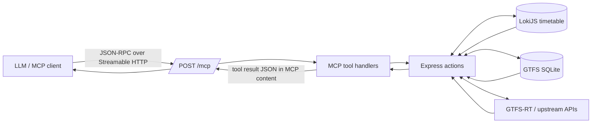

# Timetable API Node

[](https://github.com/vbhjckfd/timetable-api-node/actions/workflows/ci.yml)
[](https://github.com/vbhjckfd/timetable-api-node/blob/master/.nvmrc)
[](https://github.com/vbhjckfd/timetable-api-node/blob/master/LICENSE)

Express-based API for Lviv transport timetable data with a read-only MCP endpoint.

## Requirements

- Node.js 22 (see `.nvmrc`)

## Run locally

```bash
nvm use
make start
```

## Test

```bash
nvm use && make test
```

## MCP Server

This service exposes a public read-only MCP endpoint over Streamable HTTP.

- MCP endpoint: `/mcp`
- Server card: `/.well-known/mcp/server-card.json`
- Discovery hint: `/robots.txt` (non-standard comment hint)

Production deployment (see `cloudbuild.yaml` for Cloud Run) serves **REST and MCP** from **[api.lad.lviv.ua](https://api.lad.lviv.ua)**. The main site **[lad.lviv.ua](https://lad.lviv.ua)** is the public transport website (this repo still links there in HTML sitemap and tables for people, not for the API host). Use your own origin when running locally.

### LLM and `/mcp` flow

An MCP client (Claude, Cursor, or the MCP SDK) talks JSON-RPC over **Streamable HTTP** to `POST /mcp`. Tool handlers reuse the same Express actions as the REST API, backed by **LokiJS** timetable data, **GTFS** SQLite (via `gtfs`), and **live GTFS-RT** feeds (for example `track.ua-gis.com`).



### Try the live API

[](https://api.lad.lviv.ua/.well-known/mcp/server-card.json)
[](https://api.lad.lviv.ua/stops.json)
[](https://api.lad.lviv.ua/routes.json)

**MCP Inspector (local):** run `npx @modelcontextprotocol/inspector`, then open the UI with transport and server URL prefilled (from the [inspector README](https://github.com/modelcontextprotocol/inspector/blob/main/README.md)):

`http://localhost:6274/?transport=streamable-http&serverUrl=https%3A%2F%2Fapi.lad.lviv.ua%2Fmcp`

<details>
<summary><strong>Postman / curl: call a tool on production</strong></summary>

`POST https://api.lad.lviv.ua/mcp` with `Content-Type: application/json`. The Streamable HTTP transport may require additional headers your MCP client sets automatically; for a quick manual test, follow the same sequence your MCP SDK uses (session `initialize`, then `tools/call`). Example **`tools/call`** body shape:

```json
{
  "jsonrpc": "2.0",
  "id": 1,
  "method": "tools/call",
  "params": {
    "name": "get_stop_timetable",
    "arguments": { "stop_code": 101 }
  }
}
```

Successful tool responses return **stringified JSON** inside MCP `content` items (`type: "text"`), as produced by the server implementation.

</details>

### Exposed tools

- `get_stop_by_code`
- `get_stop_timetable`
- `get_closest_stops`
- `get_route_static`
- `get_route_dynamic`
- `get_route_final_stop_schedule`

<details>
<summary><code>get_stop_by_code</code> — input &amp; example</summary>

**Arguments (JSON):**

| Field | Type | Required |
|-------|------|----------|
| `stop_code` | positive integer | yes |
| `include_timetable` | boolean | no (default `false`) |

**Example result** (shape only; values from upstream):

```json
{
  "code": 1234,
  "name": "Mock Stop",
  "timetable": [{ "route": "1A", "time": "12:00" }]
}
```

</details>

<details>
<summary><code>get_stop_timetable</code> — input &amp; example</summary>

**Arguments:**

| Field | Type | Required |
|-------|------|----------|
| `stop_code` | positive integer | yes |

**Example result:**

```json
[
  { "stopCode": 101, "route": "3", "time": "12:05" }
]
```

</details>

<details>
<summary><code>get_closest_stops</code> — input &amp; example</summary>

**Arguments:**

| Field | Type | Required |
|-------|------|----------|
| `latitude` | number, -90…90 | yes |
| `longitude` | number, -180…180 | yes |

**Example result:**

```json
[
  {
    "code": 101,
    "name": "Closest",
    "latitude": 49.84,
    "longitude": 24.02
  }
]
```

</details>

<details>
<summary><code>get_route_static</code> — input &amp; example</summary>

**Arguments:**

| Field | Type | Required |
|-------|------|----------|
| `route_name` | non-empty string | yes |

**Example result:**

```json
{
  "route_short_name": "1A",
  "stops": [[], []],
  "shapes": [[], []]
}
```

</details>

<details>
<summary><code>get_route_dynamic</code> — input &amp; example</summary>

**Arguments:**

| Field | Type | Required |
|-------|------|----------|
| `route_name` | non-empty string | yes |

**Example result:**

```json
[
  {
    "id": "vehicle-1",
    "direction": 0,
    "location": [49.84, 24.02]
  }
]
```

</details>

<details>
<summary><code>get_route_final_stop_schedule</code> — input &amp; example</summary>

**Arguments:**

| Field | Type | Required |
|-------|------|----------|
| `route_name` | non-empty string | yes |

**Example result** (fields such as `color`, `type`, and stop details come from the live DB):

```json
{
  "id": "EXT-123",
  "color": "#e30613",
  "type": "bus",
  "route_short_name": "61",
  "route_long_name": "Example route name",
  "directions": [
    {
      "direction": 0,
      "terminus": {
        "code": 101,
        "name": "Terminus A",
        "eng_name": "Terminus A",
        "microgiz_id": "MGA",
        "loc": [24.03, 49.84]
      },
      "departures": ["10:00", "10:30"]
    },
    {
      "direction": 1,
      "terminus": {
        "code": 202,
        "name": "Terminus B",
        "eng_name": "Terminus B",
        "microgiz_id": "MGB",
        "loc": [24.04, 49.85]
      },
      "departures": ["11:00"]
    }
  ]
}
```

</details>

### Security model

- Public read-only (no authentication).
- No mutating tools are exposed.
- `robots.txt` is only a best-effort discovery hint and not a protocol contract.
