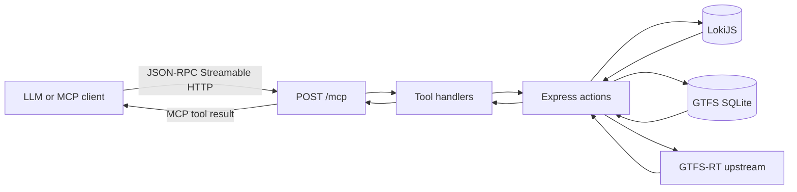

# Timetable API Node

[](https://github.com/vbhjckfd/timetable-api-node/actions/workflows/ci.yml)
[](https://github.com/vbhjckfd/timetable-api-node/blob/master/.nvmrc)
[](https://github.com/vbhjckfd/timetable-api-node/blob/master/LICENSE)

Express-based API for Lviv transport timetable data with a read-only MCP endpoint.

## Requirements

- Node.js 22 (see `.nvmrc`)

## Run locally

```bash
nvm use
make start
```

## Test

```bash
nvm use && make test
```

## MCP Server

This service exposes a public read-only MCP endpoint over Streamable HTTP.

- MCP endpoint: `/mcp`
- Server card: `/.well-known/mcp/server-card.json`
- Discovery hint: `/robots.txt` (non-standard comment hint)

Production deployment (see `cloudbuild.yaml` for Cloud Run) serves **REST and MCP** from **[api.lad.lviv.ua](https://api.lad.lviv.ua)**. The main site **[lad.lviv.ua](https://lad.lviv.ua)** is the public transport website (this repo still links there in HTML sitemap and tables for people, not for the API host). Use your own origin when running locally.

### LLM and `/mcp` flow

An MCP client (Claude, Cursor, or the MCP SDK) talks JSON-RPC over **Streamable HTTP** to `POST /mcp`. Tool handlers reuse the same Express actions as the REST API, backed by **LokiJS** timetable data, **GTFS** SQLite (via `gtfs`), and **live GTFS-RT** feeds (for example `track.ua-gis.com`).



### Try the live API

[](https://api.lad.lviv.ua/.well-known/mcp/server-card.json)
[](https://api.lad.lviv.ua/stops.json)
[](https://api.lad.lviv.ua/routes.json)

**MCP Inspector (local):** run `npx @modelcontextprotocol/inspector`, then open the UI with transport and server URL prefilled (from the [inspector README](https://github.com/modelcontextprotocol/inspector/blob/main/README.md)):

`http://localhost:6274/?transport=streamable-http&serverUrl=https%3A%2F%2Fapi.lad.lviv.ua%2Fmcp`

<details>
<summary><strong>Postman / curl: call a tool on production</strong></summary>

`POST https://api.lad.lviv.ua/mcp` with `Content-Type: application/json`. The Streamable HTTP transport may require additional headers your MCP client sets automatically; for a quick manual test, follow the same sequence your MCP SDK uses (session `initialize`, then `tools/call`). Example **`tools/call`** body shape:

```json
{
  "jsonrpc": "2.0",
  "id": 1,
  "method": "tools/call",
  "params": {
    "name": "get_stop_realtime",
    "arguments": { "stop_id": 101 }
  }
}
```

Successful tool responses return **stringified JSON** inside MCP `content` items (`type: "text"`), and each payload follows a strict UI contract:

```json
{
  "view": "transit_realtime",
  "data": { "...": "tool-specific source data" },
  "ui_blocks": [
    { "type": "map", "data": { "...": "map renderer input" } },
    { "type": "arrival_list", "data": { "...": "arrival list renderer input" } }
  ]
}
```

Consistency rule: each vehicle rendered on map must either have a matching ETA in list data or `eta_status: "unassigned"`.

</details>

### Exposed tools

- `get_stop_realtime`
- `get_vehicles_by_stop`
- `get_stop_geometry`

<details>
<summary><code>get_stop_realtime</code> — input &amp; example</summary>

**Arguments (JSON):**

| Field | Type | Required |
|-------|------|----------|
| `stop_id` | positive integer or digits-only string | yes |

**Example result** (shape only; values from upstream):

```json
{
  "view": "transit_realtime",
  "data": {
    "stop": { "id": "707", "name": "Стадіон Сільмаш", "lat": 49.84, "lng": 24.03 },
    "arrivals": [
      {
        "route": "T30",
        "direction": "Рясівська",
        "vehicle_type": "tram",
        "arrival_minutes": 4,
        "vehicle_id": "tram_123",
        "lat": 49.83,
        "lng": 24.02,
        "bearing": 120
      }
    ],
    "updated_at": "2026-01-23T12:00:00Z"
  },
  "ui_blocks": [
    {
      "type": "map",
      "data": { "center": [49.84, 24.03], "vehicles": [] }
    },
    {
      "type": "arrival_list",
      "data": { "arrivals": [] }
    }
  ]
}
```

</details>

<details>
<summary><code>get_vehicles_by_stop</code> — input &amp; example</summary>

**Arguments:**

| Field | Type | Required |
|-------|------|----------|
| `stop_ids` | array of positive integers and/or digits-only strings | yes |

**Example result:**

```json
{
  "view": "transit_realtime",
  "data": {
    "stop_ids": ["707"],
    "stops": [{ "id": "707", "name": "Стадіон Сільмаш", "lat": 49.84, "lng": 24.03 }],
    "vehicles": [
      {
        "id": "tram_123",
        "route": "T30",
        "lat": 49.83,
        "lng": 24.02,
        "bearing": 120,
        "next_stop_id": "707",
        "eta_minutes": 4,
        "eta_status": "assigned"
      }
    ]
  },
  "ui_blocks": [{ "type": "map", "data": { "vehicles": [] } }]
}
```

</details>

<details>
<summary><code>get_stop_geometry</code> — input &amp; example</summary>

**Arguments:**

| Field | Type | Required |
|-------|------|----------|
| `stop_id` | positive integer or digits-only string | yes |

**Example result:**

```json
{
  "view": "transit_realtime",
  "data": {
    "stop": { "id": "707", "name": "Стадіон Сільмаш", "lat": 49.84, "lng": 24.03 },
    "routes": [
      {
        "route": "T30",
        "polyline": [[49.84, 24.03], [49.83, 24.02]]
      }
    ]
  },
  "ui_blocks": [{ "type": "map", "data": { "routes": [] } }]
}
```

</details>

### Security model

- Public read-only (no authentication).
- No mutating tools are exposed.
- `robots.txt` is only a best-effort discovery hint and not a protocol contract.
