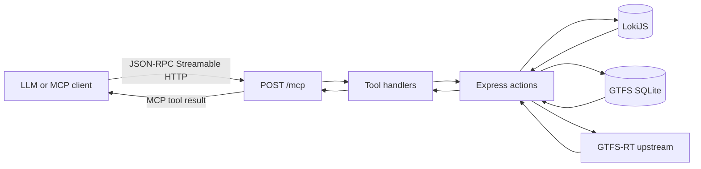

# Timetable API Node

[](https://github.com/vbhjckfd/timetable-api-node/actions/workflows/ci.yml)
[](https://github.com/vbhjckfd/timetable-api-node/blob/master/.nvmrc)
[](https://github.com/vbhjckfd/timetable-api-node/blob/master/LICENSE)
[](https://registry.modelcontextprotocol.io/v0/servers/io.github.vbhjckfd%2Ftimetable-api-node/versions)

Express-based API for Lviv transport timetable data with a read-only MCP endpoint.

[](https://smithery.ai/servers/vbhjckfd/lad-lviv-ua)
[](https://glama.ai/mcp/servers/vbhjckfd/timetable-api-node)

[](https://glama.ai/mcp/servers/vbhjckfd/timetable-api-node)

## Requirements

- Node.js 24 (see `.nvmrc`)

## Run locally

```bash
nvm use
make start
```

## Test

```bash
nvm use && make test
```

## MCP Server

This service exposes a public read-only MCP endpoint over Streamable HTTP.

- MCP endpoint: `/mcp`
- Server card: `/.well-known/mcp/server-card.json`
- Discovery hint: `/robots.txt` (non-standard comment hint)

Production deployment (see `cloudbuild.yaml` for Cloud Run) serves **REST and MCP** from **[api.lad.lviv.ua](https://api.lad.lviv.ua)**. The main site **[lad.lviv.ua](https://lad.lviv.ua)** is the public transport website (this repo still links there in HTML sitemap and tables for people, not for the API host). Use your own origin when running locally.

### LLM and `/mcp` flow

An MCP client (Claude, Cursor, or the MCP SDK) talks JSON-RPC over **Streamable HTTP** to `POST /mcp`. Tool handlers reuse the same Express actions as the REST API, backed by **LokiJS** timetable data, **GTFS** SQLite (via `gtfs`), and **live GTFS-RT** feeds (for example `track.ua-gis.com`).



### Try the live API

[](https://api.lad.lviv.ua/.well-known/mcp/server-card.json)
[](https://api.lad.lviv.ua/stops.json)
[](https://api.lad.lviv.ua/routes.json)

**MCP Inspector (local):** run `npx @modelcontextprotocol/inspector`, then open the UI with transport and server URL prefilled (from the [inspector README](https://github.com/modelcontextprotocol/inspector/blob/main/README.md)):

`http://localhost:6274/?transport=streamable-http&serverUrl=https%3A%2F%2Fapi.lad.lviv.ua%2Fmcp`

<details>
<summary><strong>Postman / curl: call a tool on production</strong></summary>

`POST https://api.lad.lviv.ua/mcp` with `Content-Type: application/json`. The Streamable HTTP transport may require additional headers your MCP client sets automatically; for a quick manual test, follow the same sequence your MCP SDK uses (session `initialize`, then `tools/call`). Example **`tools/call`** body shape:

```json
{
  "jsonrpc": "2.0",
  "id": 1,
  "method": "tools/call",
  "params": {
    "name": "get_stop_realtime",
    "arguments": { "stop_id": 101 }
  }
}
```

Successful tool responses return a **natural-language text summary** inside MCP `content` items (`type: "text"`) — e.g. *"Stop «Opera»: 3 arrivals. Next: T01 → «Rynok» in 2 min."* The full structured payload is in the `structuredContent` field (for schema-aware clients). Each `structuredContent` payload follows a strict UI contract:

```json
{
  "view": "transit_realtime",
  "data": { "...": "tool-specific source data" },
  "ui_blocks": [
    { "type": "map", "data": { "...": "map renderer input" } },
    { "type": "arrival_list", "data": { "...": "arrival list renderer input" } }
  ]
}
```

Consistency rule: each vehicle rendered on map must either have a matching ETA in list data or `eta_status: "unassigned"`.

</details>

### Exposed tools

- `get_stop_realtime`
- `get_route_static`
- `get_route_realtime`
- `get_stop_geometry`
- `get_stops_around_location`
- `get_nearby_vehicles`
- `get_vehicle_info`
- `plan_trip`

<details>
<summary><code>get_stop_realtime</code> — input &amp; example</summary>

**Arguments (JSON):**

| Field | Type | Required |
|-------|------|----------|
| `stop_id` | positive integer or digits-only string | yes |

**Example result** (shape only; values from upstream):

```json
{
  "view": "transit_realtime",
  "data": {
    "stop": { "id": "707", "name": "Стадіон Сільмаш", "lat": 49.84, "lng": 24.03 },
    "arrivals": [
      {
        "route": "T30",
        "direction": "Рясівська",
        "vehicle_type": "tram",
        "arrival_minutes": 4,
        "vehicle_id": "tram_123",
        "lat": 49.83,
        "lng": 24.02,
        "bearing": 120
      }
    ],
    "updated_at": "2026-01-23T12:00:00Z"
  },
  "ui_blocks": [
    {
      "type": "map",
      "data": { "center": [49.84, 24.03], "vehicles": [] }
    },
    {
      "type": "arrival_list",
      "data": { "arrivals": [] }
    }
  ]
}
```

</details>

<details>
<summary><code>get_route_static</code> — input &amp; example</summary>

**Arguments (JSON):**

| Field | Type | Required |
|-------|------|----------|
| `route_name` | route short name (e.g. `"T30"`, `"32A"`) or numeric external ID | yes |

**Example result** (shape only; stops truncated for brevity):

```json
{
  "view": "transit_realtime",
  "data": {
    "route": {
      "name": "T30",
      "long_name": "Рясне-2 — Сихів",
      "color": "#e81717",
      "type": "tram"
    },
    "stops": [
      [
        {
          "id": "101", "name": "Головний вокзал", "lat": 49.841, "lng": 24.003,
          "departures": ["05:30", "05:52"],
          "schedule": { "workday": ["05:30", "05:52", "06:10"], "weekend": ["07:00", "07:30"] }
        },
        { "id": "707", "name": "Стадіон Сільмаш", "lat": 49.838, "lng": 24.021, "departures": [], "schedule": { "workday": [], "weekend": [] } }
      ],
      [
        { "id": "707", "name": "Стадіон Сільмаш", "lat": 49.838, "lng": 24.021, "departures": [], "schedule": { "workday": [], "weekend": [] } },
        { "id": "101", "name": "Головний вокзал", "lat": 49.841, "lng": 24.003, "departures": [], "schedule": { "workday": [], "weekend": [] } }
      ]
    ],
    "shapes": [
      [[49.841, 24.003], [49.839, 24.012], [49.838, 24.021]],
      [[49.838, 24.021], [49.839, 24.012], [49.841, 24.003]]
    ],
    "updated_at": "2026-01-23T12:00:00Z"
  },
  "ui_blocks": [
    {
      "type": "map",
      "data": {
        "center": [49.841, 24.003],
        "zoom": 13,
        "polylines": [[[49.841, 24.003], [49.839, 24.012], [49.838, 24.021]]],
        "stops": [
          { "id": "101", "name": "Головний вокзал", "lat": 49.841, "lng": 24.003 },
          { "id": "707", "name": "Стадіон Сільмаш", "lat": 49.838, "lng": 24.021 }
        ],
        "vehicles": []
      }
    }
  ]
}
```

`stops[0]` is direction 0 (outbound), `stops[1]` is direction 1 (return). `departures` and `schedule` are populated only for the **first stop of direction 0**; all other stops have empty arrays. `schedule.workday` contains Monday–Friday departure times; `schedule.weekend` contains Saturday–Sunday departure times. `departures` keeps today's schedule for backward compatibility. `shapes` follows the same two-element order. The map block uses direction-0 polyline and all unique stops as markers.

</details>

<details>
<summary><code>get_route_realtime</code> — input &amp; example</summary>

**Arguments (JSON):**

| Field | Type | Required |
|-------|------|----------|
| `route_name` | route short name (e.g. `"T30"`, `"32A"`) or numeric external ID | yes |

**Example result:**

```json
{
  "view": "transit_realtime",
  "data": {
    "route_name": "T30",
    "vehicles": [
      {
        "id": "tram_123",
        "direction": 0,
        "lat": 49.838,
        "lng": 24.021,
        "bearing": 120,
        "lowfloor": true
      }
    ],
    "updated_at": "2026-01-23T12:00:00Z"
  },
  "ui_blocks": [
    {
      "type": "map",
      "data": {
        "center": [49.838, 24.021],
        "zoom": 13,
        "vehicles": [
          {
            "id": "tram_123",
            "direction": 0,
            "lat": 49.838,
            "lng": 24.021,
            "bearing": 120,
            "lowfloor": true
          }
        ]
      }
    }
  ]
}
```

`direction` matches the index into `get_route_static`'s `stops` array (0 = outbound, 1 = return). `lowfloor: true` indicates a low-floor vehicle. Returns an empty `vehicles` array when no vehicles are currently active on the route.

</details>

<details>
<summary><code>get_stop_geometry</code> — input &amp; example</summary>

**Arguments:**

| Field | Type | Required |
|-------|------|----------|
| `stop_id` | positive integer or digits-only string | yes |

**Example result:**

```json
{
  "view": "transit_realtime",
  "data": {
    "stop": { "id": "707", "name": "Стадіон Сільмаш", "lat": 49.84, "lng": 24.03 },
    "routes": [
      {
        "route": "T30",
        "polyline": [[49.84, 24.03], [49.83, 24.02]]
      }
    ]
  },
  "ui_blocks": [{ "type": "map", "data": { "routes": [] } }]
}
```

</details>

<details>
<summary><code>get_stops_around_location</code> — input &amp; example</summary>

Returns stops near a map point (numeric **code**, name, coordinates, distance). Intended for hosts that render **`map`** UI blocks (for example ChatGPT): one block with **multiple stop markers** and the search center. Uses the same backend as **`GET /closest`** (see below).

**Arguments (JSON):**

| Field | Type | Required |
|-------|------|----------|
| `latitude` | number, −90…90 | yes |
| `longitude` | number, −180…180 | yes |
| `radius_meters` | integer, 50…3000 | no (default **1000**) |

**Example result** (shape only):

```json
{
  "view": "transit_realtime",
  "data": {
    "center_lat": 49.84,
    "center_lng": 24.03,
    "radius_meters": 1000,
    "stops": [
      {
        "id": "707",
        "name": "Стадіон Сільмаш",
        "lat": 49.841,
        "lng": 24.031,
        "distance_meters": 120
      }
    ],
    "updated_at": "2026-01-23T12:00:00Z"
  },
  "ui_blocks": [
    {
      "type": "map",
      "data": {
        "center": [49.84, 24.03],
        "zoom": 15,
        "stops": [
          {
            "id": "707",
            "name": "Стадіон Сільмаш",
            "lat": 49.841,
            "lng": 24.031,
            "distance_meters": 120
          }
        ],
        "vehicles": []
      }
    }
  ]
}
```

Map zoom is **15** for radius ≤ 1500 m and **14** for larger radii (up to 3000 m).

</details>

<details>
<summary><code>get_nearby_vehicles</code> — input &amp; example</summary>

Returns live positions for all transit vehicles within 1 km of given coordinates. Wraps the same backend as `GET /transport`.

**Arguments (JSON):**

| Field | Type | Required |
|-------|------|----------|
| `latitude` | number, −90…90 | yes |
| `longitude` | number, −180…180 | yes |

**Example result** (shape only):

```json
{
  "view": "transit_realtime",
  "data": {
    "center_lat": 49.84,
    "center_lng": 24.03,
    "vehicles": [
      {
        "id": "tram_123",
        "route": "T01",
        "vehicle_type": "tram",
        "lat": 49.841,
        "lng": 24.031,
        "bearing": 90,
        "lowfloor": true
      }
    ],
    "updated_at": "2026-01-23T12:00:00Z"
  },
  "ui_blocks": [
    {
      "type": "map",
      "data": {
        "center": [49.84, 24.03],
        "zoom": 14,
        "vehicles": [{ "id": "tram_123", "route": "T01", "lat": 49.841, "lng": 24.031, "bearing": 90, "eta_status": "unassigned" }]
      }
    }
  ]
}
```

</details>

<details>
<summary><code>get_vehicle_info</code> — input &amp; example</summary>

Full details for one vehicle by its ID: position, route, license plate, direction, and upcoming stop arrival times. Vehicle IDs come from `get_route_realtime`, `get_nearby_vehicles`, or `get_stop_realtime`.

**Arguments (JSON):**

| Field | Type | Required |
|-------|------|----------|
| `vehicle_id` | string | yes |

**Example result** (shape only):

```json
{
  "view": "transit_realtime",
  "data": {
    "vehicle_id": "tram_123",
    "route": "route-ext-1",
    "license_plate": "BC-1234-AB",
    "lat": 49.841,
    "lng": 24.031,
    "bearing": 90,
    "direction": 0,
    "upcoming_stops": [
      { "code": 707, "arrival": "2026-01-23T12:05:00Z", "departure": null },
      { "code": 708, "arrival": "2026-01-23T12:08:00Z", "departure": null }
    ],
    "updated_at": "2026-01-23T12:00:00Z"
  },
  "ui_blocks": [
    {
      "type": "map",
      "data": { "center": [49.841, 24.031], "zoom": 15, "vehicles": [{ "id": "tram_123", "eta_status": "unassigned" }] }
    }
  ]
}
```

</details>

<details>
<summary><code>plan_trip</code> — input &amp; example</summary>

Plans a transit trip from an origin stop to a destination stop using the static route graph. Returns direct options (one route) and 1-transfer options sorted by fewest stops. Does **not** account for realtime disruptions — combine with `get_stop_realtime` for live ETAs after planning.

**Arguments (JSON):**

| Field | Type | Required |
|-------|------|----------|
| `origin_stop_id` | positive integer or digits-only string | yes |
| `destination_stop_id` | positive integer or digits-only string | yes |

**Example result** (direct trip):

```json
{
  "view": "transit_realtime",
  "data": {
    "origin": { "id": "101", "name": "Головний вокзал" },
    "destination": { "id": "707", "name": "Стадіон Сільмаш" },
    "options": [
      {
        "type": "direct",
        "route": "T30",
        "direction": 0,
        "board_stop_code": 101,
        "board_stop_name": "Головний вокзал",
        "alight_stop_code": 707,
        "alight_stop_name": "Стадіон Сільмаш",
        "stops_count": 4
      }
    ],
    "updated_at": "2026-01-23T12:00:00Z"
  },
  "ui_blocks": []
}
```

**Transfer trip** option shape:

```json
{
  "type": "transfer",
  "route1": "T01",
  "route2": "А05",
  "board_stop_code": 101,
  "board_stop_name": "Головний вокзал",
  "transfer_stop_code": 303,
  "transfer_stop_name": "Площа Ринок",
  "alight_stop_code": 707,
  "alight_stop_name": "Стадіон Сільмаш",
  "stops_count_1": 3,
  "stops_count_2": 2
}
```

Up to 5 direct and 3 transfer options are returned. Use `get_stops_around_location` to resolve addresses or coordinates to stop codes before calling this tool.

</details>

### Resources and resource templates

In addition to tools, the server exposes MCP **resources** for reference data that doesn't require a tool call:

| URI | Description |
|-----|-------------|
| `timetable://about` | Scope, usage, and data caveats for this server (Markdown) |
| `timetable://reference/tools` | Tools reference table (Markdown) |
| `timetable://reference/prompts` | Prompt templates catalog (Markdown) |
| `timetable://stop/{code}` | Static info for a stop by numeric code — name, coordinates, serving routes (JSON) |
| `timetable://route/{name}` | Static metadata for a route by short name — color, type, stop counts (JSON) |

### Security model

- Public read-only (no authentication).
- No mutating tools are exposed.
- `POST /mcp` is rate-limited to **60 requests/min per IP** (in-memory, resets on restart). Excess requests receive HTTP 429 with a JSON-RPC error body.
- `robots.txt` is only a best-effort discovery hint and not a protocol contract.

## REST API

All endpoints return JSON. `:code` is a numeric stop code; `:name` is a route short name (e.g. `T1`, `32A`) or numeric external ID.

### Stops

#### `GET /stops.json`

All stops as a JSON array, sorted by code.

- **Response:** array of `{ code, name, eng_name, location: [lat, lng], routes, sign, sign_pdf }`.

(`GET /stops` returns an HTML table instead.)

#### `GET /stops/:code`

Single stop with live realtime timetable. Short-cached (5–10 s).

- **Optional:** `skipTimetableData=1` — omit live arrivals (long-cached response).
- **Response:** `{ code, name, eng_name, latitude, longitude, transfers, timetable }`.

#### `GET /stops/:code/timetable`

Live timetable only for a stop. Short-cached (5–10 s).

- **Response:** array of timetable items.

#### `GET /stops/:code/static`

Static stop info without live data. Long-cached (30 days).

- **Response:** `{ code, name, eng_name, latitude, longitude, transfers }`.

#### `GET /closest?latitude={lat}&longitude={lng}`

Nearby stops — same search as `get_stops_around_location`, for non-MCP clients.

- **Optional:** `radius` — meters, clamped between **50** and **3000** (default **1000**).
- **Response:** JSON array of `{ code, name, latitude, longitude, distance_meters }` (sorted by distance).

### Routes

#### `GET /routes.json`

All routes as a JSON array, sorted by short name.

- **Response:** raw route objects from the timetable store.

(`GET /routes` returns an HTML table.)

#### `GET /routes/static/:name`

Route shape, stop list, and metadata. Long-cached (30 days).

- **Response:** `{ id, color, type, route_short_name, route_long_name, stops: [[dir0…], [dir1…]], shapes }`.
- Each stop object: `{ code, name, loc, transfers, departures, schedule }`.
  - `departures` — today's departure times (HH:MM), populated only for direction 0 first stop. Kept for backward compatibility.
  - `schedule` — `{ workday: string[], weekend: string[] }` departure times by day type, populated only for direction 0 first stop.

#### `GET /routes/dynamic/:name`

Live vehicle positions for a route. Short-cached (10 s).

- **Response:** array of `{ id, direction, location: [lat, lng], bearing, speed, lowfloor }`. `speed` is m/s from the GPS unit, or `null` when not reported.

### Vehicles

#### `GET /vehicle/:vehicleId`

Live position and upcoming stop arrivals for one vehicle. Short-cached (5 s).

- **Response:** `{ location: [lat, lng], routeId, bearing, speed, direction, licensePlate, arrivals }`. `speed` is m/s from the GPS unit, or `null` when not reported.

#### `GET /vehicle-by-plate/:plate`

Look up a vehicle ID by its license plate. Short-cached (5 s).

- The plate is matched case-insensitively with spaces and dashes ignored (`BC-1234-AA`, `bc 1234 aa`, and `bc1234aa` are all equivalent).
- **Response:** `{ vehicleId }` — use the returned ID with `GET /vehicle/:vehicleId`.

#### `GET /transport?latitude={lat}&longitude={lng}`

Vehicles within 1 km of a point. Short-cached (10 s).

- **Response:** array of `{ id, route, routeId, direction, vehicle_type, color, location: [lat, lng], bearing, speed, lowfloor }`. `routeId` is usable as `:name` in `/routes/static/:name`; `direction` matches the index into `stops`/`shapes` (0 = outbound, 1 = return, null if unknown). `speed` is m/s or `null`.

### Trip planning

#### `GET /trip-plan?origin={code}&destination={code}`

Static trip planning between two stops using the route graph.

- **Response:** `{ origin, destination, options }` where each option is either a `direct` trip (single route) or a `transfer` trip (two routes with a transfer stop). Up to 5 direct and 3 transfer options, sorted by fewest stops.
- Cached for 60 s.
