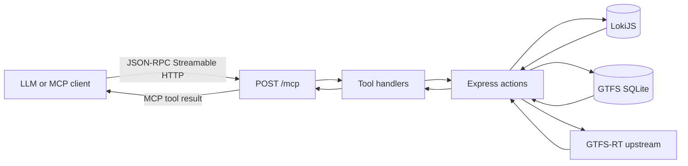

# Timetable API Node

[](https://github.com/vbhjckfd/timetable-api-node/actions/workflows/ci.yml)
[](https://github.com/vbhjckfd/timetable-api-node/blob/master/.nvmrc)
[](https://github.com/vbhjckfd/timetable-api-node/blob/master/LICENSE)
[](https://registry.modelcontextprotocol.io/v0/servers/io.github.vbhjckfd%2Ftimetable-api-node/versions)

Express-based API for Lviv transport timetable data with a read-only MCP endpoint.

[](https://smithery.ai/servers/vbhjckfd/lad-lviv-ua)
[](https://glama.ai/mcp/servers/vbhjckfd/timetable-api-node)

[](https://glama.ai/mcp/servers/vbhjckfd/timetable-api-node)

## Requirements

- Node.js 26 (see `.nvmrc`)

## Run locally

```bash
nvm use
make start
```

## Test

```bash
nvm use && make test
```

## Monitoring

Two optional integrations, both off unless their environment variable is set:

| Variable | Effect |
| --- | --- |
| `SENTRY_DSN` | Error reporting via `instrument.js` |
| `NEW_RELIC_LICENSE_KEY` | New Relic APM via `newrelic.cjs` |

New Relic runs as a preloaded agent, so `npm start` carries the flags:

```bash
node -r dotenv/config -r newrelic --import newrelic/esm-loader.mjs index.js
```

`dotenv/config` is preloaded first so `.env` is populated before the agent
reads its configuration. The config file is `newrelic.cjs` (the agent is
CommonJS and this project is ESM) and holds no secrets — the key comes from the
environment. `/health` is excluded from transactions via `rules.ignore`.

The account is in the **EU** region; its license key starts with `eu01xx` and
the agent picks the collector from that prefix. Use the 40-character ingest
license key, not an `NRAK-...` user API key.

Cloud Run reads the key from Secret Manager:

```bash
gcloud run services update timetable-api-node --region=us-central1 --project=timetable-252615 --set-secrets=NEW_RELIC_LICENSE_KEY=new-relic-license-key:latest
```

## MCP Server

This service exposes a public read-only MCP endpoint over Streamable HTTP.

- MCP endpoint: `/mcp`
- Server card: `/.well-known/mcp/server-card.json`
- Discovery hint: `/robots.txt` (non-standard comment hint)

Production deployment (see `cloudbuild.yaml` for Cloud Run) serves **REST and MCP** from **[api.lad.lviv.ua](https://api.lad.lviv.ua)**. The main site **[lad.lviv.ua](https://lad.lviv.ua)** is the public transport website (this repo still links there in HTML sitemap and tables for people, not for the API host). Use your own origin when running locally.

### LLM and `/mcp` flow

An MCP client (Claude, Cursor, or the MCP SDK) talks JSON-RPC over **Streamable HTTP** to `POST /mcp`. Tool handlers reuse the same Express actions as the REST API, backed by **LokiJS** timetable data, **GTFS** SQLite (via `gtfs`), and **live GTFS-RT** feeds (for example `track.ua-gis.com`).


```mermaid
graph LR;
  Client[LLM or MCP client] -->|JSON-RPC Streamable HTTP| Mcp["POST /mcp"];
  Mcp --> Tools[Tool handlers];
  Tools --> Actions[Express actions];
  Actions --> Loki[(LokiJS)];
  Actions --> Gtfs[(GTFS SQLite)];
  Actions --> Rt[GTFS-RT upstream];
  Loki --> Actions;
  Gtfs --> Actions;
  Rt --> Actions;
  Actions --> Tools;
  Tools --> Mcp;
  Mcp -->|MCP tool result| Client;
```

### Try the live API

[](https://api.lad.lviv.ua/.well-known/mcp/server-card.json)
[](https://api.lad.lviv.ua/stops.json)
[](https://api.lad.lviv.ua/routes.json)

**MCP Inspector (local):** run `npx @modelcontextprotocol/inspector`, then open the UI with transport and server URL prefilled (from the [inspector README](https://github.com/modelcontextprotocol/inspector/blob/main/README.md)):

`http://localhost:6274/?transport=streamable-http&serverUrl=https%3A%2F%2Fapi.lad.lviv.ua%2Fmcp`

<details>
<summary><strong>Postman / curl: call a tool on production</strong></summary>

`POST https://api.lad.lviv.ua/mcp` with `Content-Type: application/json` **and** `Accept: application/json, text/event-stream` — the Streamable HTTP transport rejects a request that does not accept both. The server is stateless: there is no session, so `tools/call` works on its own without an `initialize` first. The response arrives as a single SSE `event: message` frame carrying the JSON-RPC result.

```bash
curl -s https://api.lad.lviv.ua/mcp \
  -H 'Content-Type: application/json' \
  -H 'Accept: application/json, text/event-stream' \
  -d '{"jsonrpc":"2.0","id":1,"method":"tools/call","params":{"name":"get_stop_realtime","arguments":{"stop_id":101}}}'
```

Example **`tools/call`** body shape:

```json
{
  "jsonrpc": "2.0",
  "id": 1,
  "method": "tools/call",
  "params": {
    "name": "get_stop_realtime",
    "arguments": { "stop_id": 101 }
  }
}
```

Successful tool responses return a **natural-language text summary** inside MCP `content` items (`type: "text"`) — e.g. *"Stop «Площа Ринок»: 6 arrivals. Next: Т02 → «Пасічна» in 3 min."* The full structured payload is in the `structuredContent` field (for schema-aware clients). Each `structuredContent` payload follows one contract:

```json
{
  "view": "transit_realtime",
  "data": { "...": "tool-specific payload" },
  "ui_blocks": [
    { "type": "map", "data": { "center": [49.84, 24.03], "zoom": 14, "layers": { "stops": "data.stop", "vehicles": "data.arrivals" } } },
    { "type": "arrival_list", "data": { "source": "data.arrivals" } }
  ]
}
```

`ui_blocks` point into `data` instead of repeating it. A `map` block gives the centre and zoom, and `layers` maps `stops`, `vehicles` and `polylines` to a dot path in the result; every stop and vehicle there has `lat`/`lng`, vehicles also `bearing`. An `arrival_list` block names the arrivals array to render, already sorted by `arrival_minutes` (`null` = no ETA).

</details>

### Exposed tools

All tools are read-only. Stop IDs are the numeric codes on stop signs, returned as strings (`"707"`). Route names are the short names on vehicles (`"Т30"`, `"А1"`); Latin `"T30"`/`"A01"` work too, and a bare number is read as an internal route ID. An unknown route or vehicle returns `isError: true` with a hint on what to pass instead.

| Tool | Arguments | Returns |
|------|-----------|---------|
| `search_stops` | `query` (string, ≥ 2 chars), `limit` (1–25, default 10) | Stops whose Ukrainian or English name contains every query word (inflection-tolerant: `"опера"` finds «Театр опери та балету»), with `routes`. |
| `get_stops_around_location` | `latitude`, `longitude`, `radius_meters` (50–3000, default 1000) | Stops near a point, nearest first, with `distance_meters` and `routes`. |
| `get_stop_realtime` | `stop_id` | Live arrivals: `route`, `direction` (destination), `vehicle_type`, `arrival_minutes`, vehicle position. |
| `find_routes_between` | `from_stop_id`, `to_stop_id` | Direct routes within a 300 m walk of each end, best first: `board_stop`, `alight_stop`, `destination`, `stops_count`, walk at each end. |
| `get_route_static` | `route_name`, `include_shapes` (default false) | Name, type, colour, stop lists for both directions, first-stop timetable; polylines only on request. |
| `get_route_realtime` | `route_name` | Vehicles on the route with `destination` and `next_stop` (`id`, `name`, ISO `arrival`). |
| `get_nearby_vehicles` | `latitude`, `longitude`, `radius_meters` (100–1000, default 500), `route`, `limit` (1–50, default 15) | Live vehicles nearest first, with `destination` and `distance_meters`; `total` counts all in range. |
| `get_vehicle_info` | `vehicle_id` | One vehicle: position, route, `destination`, plate, upcoming stops (`id`, `name`, ISO times) not yet passed. |

<details>
<summary><code>get_stop_realtime</code> — example</summary>

```json
{
  "view": "transit_realtime",
  "data": {
    "stop": { "id": "61", "name": "Площа Ринок", "lat": 49.84146, "lng": 24.03227 },
    "arrivals": [
      {
        "route": "Т02",
        "direction": "Пасічна",
        "vehicle_type": "tram",
        "arrival_minutes": 3,
        "vehicle_id": "2393",
        "lat": 49.83461,
        "lng": 24.01672,
        "bearing": 60
      }
    ],
    "updated_at": "2026-09-23T09:01:21Z"
  },
  "ui_blocks": [
    {
      "type": "map",
      "data": { "center": [49.84146, 24.03227], "zoom": 14, "layers": { "stops": "data.stop", "vehicles": "data.arrivals" } }
    },
    { "type": "arrival_list", "data": { "source": "data.arrivals" } }
  ]
}
```

</details>

<details>
<summary><code>search_stops</code> — example</summary>

```json
{
  "view": "transit_realtime",
  "data": {
    "query": "rynok",
    "stops": [
      {
        "id": "61",
        "name": "Площа Ринок",
        "lat": 49.84146,
        "lng": 24.03227,
        "eng_name": "Rynok square",
        "routes": ["Т01", "Т02"]
      }
    ],
    "updated_at": "2026-09-23T09:36:53Z"
  },
  "ui_blocks": [
    { "type": "map", "data": { "center": [49.84146, 24.03227], "zoom": 14, "layers": { "stops": "data.stops" } } }
  ]
}
```

One stop name usually covers both sides of the street under different IDs; each is returned, and `routes` tells them apart. `get_stops_around_location` returns the same stop objects plus `distance_meters`.

</details>

<details>
<summary><code>find_routes_between</code> — example</summary>

Text summary: *"3 direct routes «Площа Ринок» → «Залізничний вокзал». Best: Т01 towards «Залізничний вокзал», 8 stops, board at «Руська» (137m walk)."*

```json
{
  "view": "transit_realtime",
  "data": {
    "from": { "id": "61", "name": "Площа Ринок", "stop_ids": ["10", "57", "58", "59", "61", "63", "855"] },
    "to": { "id": "118", "name": "Залізничний вокзал", "stop_ids": ["117", "118", "188", "189", "190", "191"] },
    "options": [
      {
        "route": "Т01",
        "vehicle_type": "tram",
        "direction": 0,
        "destination": "Залізничний вокзал",
        "board_stop": { "id": "58", "name": "Руська", "lat": 49.84186, "lng": 24.03408 },
        "alight_stop": { "id": "118", "name": "Залізничний вокзал", "lat": 49.839, "lng": 23.99677 },
        "stops_count": 8,
        "walk_to_board_meters": 137,
        "walk_from_alight_meters": 0
      }
    ],
    "updated_at": "2026-09-23T09:36:53Z"
  },
  "ui_blocks": []
}
```

Each end covers every stop within a 300 m walk (`stop_ids`): a line's two directions often stop on opposite sides of a street under different names, as here, where Т01 towards the station leaves from «Руська», not «Площа Ринок». Options are ranked by stops plus walking (150 m of walking weighs as one stop), one per route and direction. A direction's last stop counts as a place to get off, not to board. Only direct routes are listed; an empty `options` means a transfer is needed.

</details>

<details>
<summary><code>get_route_static</code> — example</summary>

```json
{
  "view": "transit_realtime",
  "data": {
    "route": { "name": "Т30", "long_name": "Університет - Городоцька - вул. Ряшівська", "color": "#EF88AA", "type": "trolleybus" },
    "stops": [
      [
        {
          "id": "101", "name": "Університет", "lat": 49.841, "lng": 24.003,
          "departures": ["05:30", "05:52"],
          "schedule": { "workday": ["05:30", "05:52", "06:10"], "weekend": ["07:00", "07:30"] }
        },
        { "id": "707", "name": "Стадіон Сільмаш", "lat": 49.838, "lng": 24.021, "departures": [], "schedule": { "workday": [], "weekend": [] } }
      ],
      [
        { "id": "707", "name": "Стадіон Сільмаш", "lat": 49.838, "lng": 24.021, "departures": ["06:00"], "schedule": { "workday": ["06:00"], "weekend": [] } }
      ]
    ],
    "updated_at": "2026-09-23T09:01:12Z"
  },
  "ui_blocks": [
    { "type": "map", "data": { "center": [49.841, 24.003], "zoom": 13, "layers": { "stops": "data.stops" } } }
  ]
}
```

`stops[0]` is direction 0 (outbound), `stops[1]` direction 1 (return). `departures` and `schedule` are populated for the **first stop of each direction**; other stops have empty arrays. `schedule.workday` is Monday–Friday, `schedule.weekend` Saturday–Sunday; `departures` keeps today's schedule for backward compatibility. With `include_shapes: true`, `data.shapes` holds one `[lat, lng]` polyline per direction and the map block adds `"polylines": "data.shapes"`.

</details>

<details>
<summary><code>get_route_realtime</code> — example</summary>

```json
{
  "view": "transit_realtime",
  "data": {
    "route_name": "Т01",
    "destinations": ["Залізничний вокзал", "Погулянка"],
    "vehicles": [
      {
        "id": "5907",
        "direction": 0,
        "destination": "Залізничний вокзал",
        "next_stop": { "id": "118", "name": "Залізничний вокзал", "arrival": "2026-09-23T09:35:00.000Z" },
        "lat": 49.83947,
        "lng": 23.99566,
        "bearing": 126,
        "lowfloor": true
      }
    ],
    "updated_at": "2026-09-23T09:32:10Z"
  },
  "ui_blocks": [
    { "type": "map", "data": { "center": [49.83947, 23.99566], "zoom": 13, "layers": { "vehicles": "data.vehicles" } } }
  ]
}
```

`route_name` is the canonical short name whatever form was passed. `direction` indexes `get_route_static`'s `stops` (0 = outbound, 1 = return) and `destinations`. `next_stop` is `null` when the feed has no trip update for the vehicle.

</details>

<details>
<summary><code>get_nearby_vehicles</code> — example</summary>

```json
{
  "view": "transit_realtime",
  "data": {
    "center_lat": 49.8419,
    "center_lng": 24.0316,
    "radius_meters": 500,
    "total": 18,
    "vehicles": [
      {
        "id": "3422",
        "route": "Т01",
        "vehicle_type": "tram",
        "direction": 0,
        "destination": "Залізничний вокзал",
        "lat": 49.84154,
        "lng": 24.03364,
        "bearing": 258,
        "lowfloor": false,
        "distance_meters": 152
      }
    ],
    "updated_at": "2026-09-23T09:32:10Z"
  },
  "ui_blocks": [
    { "type": "map", "data": { "center": [49.8419, 24.0316], "zoom": 15, "layers": { "vehicles": "data.vehicles" } } }
  ]
}
```

</details>

<details>
<summary><code>get_vehicle_info</code> — example</summary>

```json
{
  "view": "transit_realtime",
  "data": {
    "vehicle_id": "5907",
    "route": "Т01",
    "license_plate": "1238",
    "lat": 49.83947,
    "lng": 23.99566,
    "bearing": 126,
    "direction": 0,
    "destination": "Залізничний вокзал",
    "upcoming_stops": [
      { "id": "118", "name": "Залізничний вокзал", "arrival": null, "departure": "2026-09-23T09:35:00.000Z" },
      { "id": "188", "name": "Приміський вокзал", "arrival": "2026-09-23T09:35:49.000Z", "departure": null }
    ],
    "updated_at": "2026-09-23T09:32:10Z"
  },
  "ui_blocks": [
    { "type": "map", "data": { "center": [49.83947, 23.99566], "zoom": 15, "layers": { "vehicles": "data" } } }
  ]
}
```

`route` is the route short name, falling back to the opaque GTFS route ID only when the route is missing from the local data. Either value is accepted as `route_name` by `get_route_static` and `get_route_realtime`. `license_plate` is `null` when the feed has none.

</details>


### Prompts

Reusable instruction templates for rendering workflows. Each takes one argument, `stop_id` (positive integer or digits-only string).

| Prompt | Use case |
|--------|----------|
| `transit-map-view` | Map-first rendering of live vehicles for a stop. |
| `transit-arrival-list` | Arrival list for a stop, sorted by ETA and grouped by route. |
| `transit-hybrid-view` | Map block first, arrival-list block second, with ETA values kept consistent across both. |

### Resources and resource templates

In addition to tools, the server exposes MCP **resources** for reference data that doesn't require a tool call:

| URI | Description |
|-----|-------------|
| `timetable://about` | Scope, usage, and data caveats for this server (Markdown) |
| `timetable://reference/tools` | Tools reference table (Markdown) |
| `timetable://reference/prompts` | Prompt templates catalog (Markdown) |
| `timetable://stop/{code}` | Static info for a stop by numeric code — name, coordinates, serving routes (JSON) |
| `timetable://route/{name}` | Static metadata for a route by short name — color, type, stop counts (JSON) |

### Security model

- Public read-only (no authentication).
- No mutating tools are exposed.
- `POST /mcp` is rate-limited to **60 requests/min per IP** (in-memory, resets on restart). Excess requests receive HTTP 429 with a JSON-RPC error body.
- `robots.txt` is only a best-effort discovery hint and not a protocol contract.

## REST API

All endpoints return JSON. `:code` is a numeric stop code; `:name` is a route short name (e.g. `T1`, `32A`) or numeric external ID.

### Stops

#### `GET /stops.json`

All stops as a JSON array, sorted by code.

- **Response:** array of `{ code, name, eng_name, location: [lat, lng], routes, sign, sign_pdf }`.

(`GET /stops` returns an HTML table instead.)

#### Per-stop route overrides

The upstream route list for a stop is sometimes behind reality. `GET /stops`
applies a stored override to its `Маршрути` column — removed routes shown red and
struck through, added ones green — and hangs the matching `?add=`/`?remove=` on
that row's SVG and PDF links, which `offline.lad.lviv.ua` and `pdf.lad.lviv.ua`
both understand.

The route column is always clickable: click a route to drop or restore it, type
one into the `+` box to add it.

Overrides live in the browser's own `localStorage` (see
[`public/stopOverrides.js`](public/stopOverrides.js)), not on a server — no
account to edit through, no cache to purge, an edit applies at once. The trade
is scope: an override is visible only in the browser that made it, not to
anyone else who opens `/stops`.

`/stops.json` reports `sign` and `sign_pdf` without overrides applied.

#### `GET /stops/:code`

Single stop with live realtime timetable. Short-cached (5–10 s).

- **Optional:** `skipTimetableData=1` — omit live arrivals (long-cached response).
- **Response:** `{ code, name, eng_name, latitude, longitude, transfers, timetable }`.

#### `GET /stops/:code/timetable`

Live timetable only for a stop. Short-cached (5–10 s).

- **Response:** array of timetable items.

#### `GET /stops/:code/static`

Static stop info without live data. Long-cached (30 days).

- **Response:** `{ code, name, eng_name, latitude, longitude, transfers }`.

#### `GET /closest?latitude={lat}&longitude={lng}`

Nearby stops — same search as `get_stops_around_location`, for non-MCP clients.

- **Optional:** `radius` — meters, clamped between **50** and **3000** (default **1000**).
- **Response:** JSON array of `{ code, name, latitude, longitude, distance_meters }` (sorted by distance).

### Routes

#### `GET /routes.json`

All routes as a JSON array, sorted by short name.

- **Response:** raw route objects from the timetable store.

(`GET /routes` returns an HTML table.)

#### `GET /routes/static/:name`

Route shape, stop list, and metadata. Long-cached (30 days).

- **Response:** `{ id, color, type, route_short_name, route_long_name, stops: [[dir0…], [dir1…]], shapes }`.
- Each stop object: `{ code, name, loc, transfers, departures, schedule }`.
  - `departures` — today's departure times (HH:MM), populated only for direction 0 first stop. Kept for backward compatibility.
  - `schedule` — `{ workday: string[], weekend: string[] }` departure times by day type, populated only for direction 0 first stop.

#### `GET /routes/dynamic/:name`

Live vehicle positions for a route. Short-cached (10 s).

- **Response:** array of `{ id, direction, location: [lat, lng], bearing, speed, lowfloor }`. `speed` is m/s from the GPS unit, or `null` when not reported.

### Vehicles

#### `GET /vehicle/:vehicleId`

Live position and upcoming stop arrivals for one vehicle. Short-cached (5 s).

- **Response:** `{ location: [lat, lng], routeId, bearing, speed, direction, licensePlate, arrivals }`. `speed` is m/s from the GPS unit, or `null` when not reported.

#### `GET /vehicle-by-plate/:plate`

Look up a vehicle ID by its license plate. Short-cached (5 s).

- The plate is matched case-insensitively with spaces and dashes ignored (`BC-1234-AA`, `bc 1234 aa`, and `bc1234aa` are all equivalent).
- **Response:** `{ vehicleId }` — use the returned ID with `GET /vehicle/:vehicleId`.

#### `GET /transport?latitude={lat}&longitude={lng}`

Vehicles within 1 km of a point. Short-cached (10 s).

- **Response:** array of `{ id, route, routeId, direction, vehicle_type, color, location: [lat, lng], bearing, speed, lowfloor }`. `routeId` is usable as `:name` in `/routes/static/:name`; `direction` matches the index into `stops`/`shapes` (0 = outbound, 1 = return, null if unknown). `speed` is m/s or `null`.
